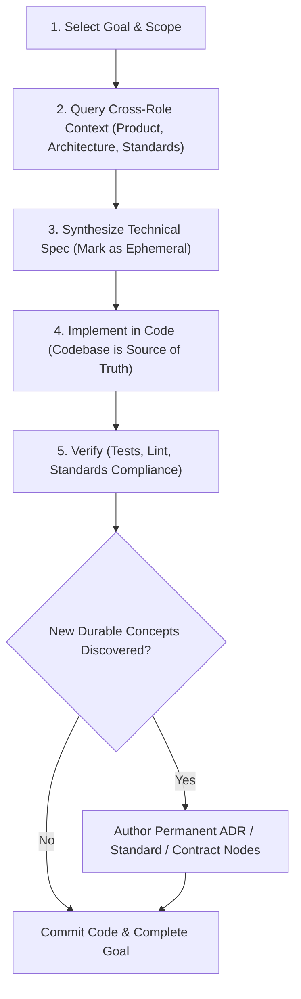

# Spool Technical Implementation

Use this skill when preparing, designing, authoring, or executing **technical implementation specifications, execution plans, and code-level technical tasks** in a Spool workspace.

> [!IMPORTANT]
> **Core Implementation Invariants**
> 1. **Code is the Living Source of Truth**: The codebase (source code, tests, types, configs) is the definitive source of truth for technical execution and behavior. Technical specifications exist to align and guide development, but they do not replace or outlive code as the long-term truth of *how* the system works.
> 2. **Ephemeral Node Tagging**: All atomic ideas generated for technical implementation details, step-by-step execution plans, and transient technical specs must be tagged with the **`Ephemeral`** label (`labels: ["Implementation", "Ephemeral", ...]`). Do **not** create permanent graph nodes for transient implementation details that will be embodied directly in code.
> 3. **Preserve Long-Lived Concepts**: Only concepts that are truly long-lived and will not be replaced by code (such as new architectural decisions, permanent schema contracts, system boundaries, or organization-wide standards) should be authored as permanent, non-ephemeral nodes using the appropriate role skills ([`spool-architecture`](../spool-architecture/SKILL.md) or [`spool-engineering-standards`](../spool-engineering-standards/SKILL.md)).
> 4. **Cross-Role Context Synthesis**: Technical implementation must take into account all upstream roles in the Spool graph relevant to the vertical goal: **Product** requirements, **Architecture** decisions & topologies, and **Engineering Standards** (security, testing, API, coding rules).

---

## 1. Domain Taxonomy & Labels

### Implementation Labels
| Label | Purpose | Example Title |
| --- | --- | --- |
| `Implementation` | Top-level domain tag applied to all technical implementation nodes | *(Used with sub-labels)* |
| `TechnicalSpec` | High-level technical execution design or component specification | `Implement atomic batch staging and commit rollback in repository engine` |
| `Plan` | Structured sequence of technical execution phases or tasks | `Multi-phase rollout plan for atomic workspace directory migration` |
| `Ephemeral` | **Mandatory tag** for transient spec/plan nodes that will be superseded by code | *(Applied alongside `Implementation` / `TechnicalSpec` / `Plan`)* |
| `Spike` | Time-boxed technical exploration or prototype finding | `Spike findings on SQLite WAL mode concurrency under concurrent readers` |
| `Task` / `Step` | Atomic technical execution unit during active development | `Add lock acquisition timeout handler to repository mutex wrapper` |

### Upstream Scoped Labels (Cross-Role Synthesis)
Technical implementation actively references and connects to nodes from all other domains:

| Domain | Referenced Labels | Purpose in Implementation Context |
| --- | --- | --- |
| **Product** | `Product`, `Requirement`, `Problem`, `Capability`, `Constraint` | What user outcome, business rule, or constraint the technical change satisfies. |
| **Architecture** | `Architecture`, `Decision`, `ADR`, `Component`, `Boundary`, `DataContract`, `QualityAttribute`, `Tradeoff` | Structural decisions, component boundaries, latency/memory invariants, and contracts to follow. |
| **Engineering Standards** | `Standard`, `Convention`, `SecurityPolicy`, `TestingStandard`, `APIStandard`, `AntiPattern` | Organizational coding policies, forbidden anti-patterns, security rules, and testing standards to obey. |

---

## 2. Standard Edge Relationships

Connect technical implementation nodes to upstream role nodes and dependent execution steps:

| Edge Type | Source Node | Target Node | Meaning |
| --- | --- | --- | --- |
| `IMPLEMENTS` | `TechnicalSpec` / `Implementation` | `Requirement` *(Product)* | The technical work implements the specified business requirement. |
| `REALIZES` | `TechnicalSpec` / `Implementation` | `Decision` *(Architecture)* | The technical work realizes or executes the architectural decision. |
| `COMPLIES_WITH` | `TechnicalSpec` / `Implementation` | `Standard` / `SecurityPolicy` / `TestingStandard` | The technical implementation conforms to the engineering standard or policy. |
| `TARGETS` | `TechnicalSpec` / `Implementation` | `Component` *(Architecture)* | The implementation modifies or belongs to the specified system component. |
| `BLOCKED_BY` | `Task` / `Step` | `Task` / `Step` | Sequential ordering between execution steps during an implementation. |
| `SUPERSEDES` | `TechnicalSpec` | `TechnicalSpec` | A revised implementation spec replaces a prior approach. |

---

## 3. Implementation Workflow



### Step 1: Cross-Role Context Gathering
Before writing technical specs or code, query the Spool graph across all roles for relevant constraints and context using Spool MCP tools by default:

- **MCP (Default)**:
  - `spl_search(query: "<feature-keyword>")`
  - `spl_query_context(query: "<component-or-feature>", direction: "both")`
  - `spl_filter(labels: ["SecurityPolicy"])`
  - `spl_filter(labels: ["TestingStandard"])`
  - `spl_filter(labels: ["AntiPattern"])`

- **CLI (Fallback)**:
  ```sh
  spl search --query "<feature-keyword>"
  spl query-context --query "<component-or-feature>" --direction both
  spl filter --label SecurityPolicy
  spl filter --label TestingStandard
  spl filter --label AntiPattern
  ```

### Step 2: Formulate Technical Spec & Execution Plan
Draft atomic implementation nodes and connect them to upstream product requirements, architecture decisions, and standards.

> [!CAUTION]
> Always include `Ephemeral` on transient implementation nodes. Do not pollute the permanent graph with ephemeral code-level details.

### Step 3: Implement in Code
Implement the changes in the codebase. The code, types, and automated tests are the primary source of truth.

### Step 4: Promote Durable Knowledge (If Any)
If the implementation uncovered a new architectural invariant or reusable standard:
- Create a permanent `Decision` / `ADR` node with `spool-architecture`.
- Create a permanent `Standard` / `SecurityPolicy` node with `spool-engineering-standards`.
- Leave transient implementation steps marked as `Ephemeral`.

### Step 5: Prune Transient Knowledge Before Merge
Before merging the implementation branch into a baseline, review the removal of transient
implementation nodes and their incident edges:

- **MCP (Default)**:
  - Preview: `spl_prune(dry_run: true)`
  - Commit: `spl_prune(author: "<author>", message: "Prune transient implementation knowledge")`

- **CLI (Fallback)**:
  ```sh
  spl prune --dry-run
  spl prune --author "<author>" --message "Prune transient implementation knowledge"
  ```

The JSON preview reports every removed `Ephemeral` node, cascading edge, and durable node left
without connections. Unbound workspaces are refused. This is graph cleanup, not pack/CAS GC.

---

## 4. Batch Authoring Example

Create a mutation-batch JSON file demonstrating cross-role synthesis and `Ephemeral` labeling:

```json
[
  {
    "action": "add",
    "entity": "node",
    "id": "spec-tx-outbox-relay-worker",
    "title": "Implement transactional outbox relay worker polling outbox table every 200ms with batch Kafka dispatch",
    "labels": ["Implementation", "TechnicalSpec", "Ephemeral"],
    "properties": {
      "pollIntervalMs": {"kind": "integer", "integer": 200},
      "batchSize": {"kind": "integer", "integer": 100},
      "status": {"kind": "string", "string": "in_progress"}
    }
  },
  {
    "action": "add",
    "entity": "node",
    "id": "task-outbox-relay-metrics",
    "title": "Add Prometheus counters for relay worker dispatched event count and batch dispatch latency",
    "labels": ["Implementation", "Task", "Ephemeral"],
    "properties": {
      "metricPrefix": {"kind": "string", "string": "outbox_relay"}
    }
  },
  {
    "action": "add",
    "entity": "edge",
    "id": "edge-spec-implements-product-req",
    "source": "spec-tx-outbox-relay-worker",
    "target": "req-deferred-billing-address",
    "type": "IMPLEMENTS"
  },
  {
    "action": "add",
    "entity": "edge",
    "id": "edge-spec-realizes-arch-adr",
    "source": "spec-tx-outbox-relay-worker",
    "target": "adr-order-outbox-kafka",
    "type": "REALIZES"
  },
  {
    "action": "add",
    "entity": "edge",
    "id": "edge-spec-complies-with-observability-std",
    "source": "task-outbox-relay-metrics",
    "target": "std-structured-json-logging",
    "type": "COMPLIES_WITH"
  },
  {
    "action": "add",
    "entity": "edge",
    "id": "edge-spec-targets-order-service",
    "source": "spec-tx-outbox-relay-worker",
    "target": "comp-order-service",
    "type": "TARGETS"
  }
]
```

Write the batch through a schema migration (short-lived branch + PR):

- **MCP (Default)**: Call `spl_schema_migrate` with the current schema and `operations`.
- **CLI (Fallback)**:
  ```sh
  spl schema migrate --schema schema.toml --batch implementation-batch.json \
    --author "Engineer <eng@example.com>" --message "Record ephemeral technical spec for outbox relay worker"
  ```

---

## 5. Querying Technical Implementation Knowledge

Discover and traverse technical implementation knowledge using Spool MCP tools by default:

- **MCP (Default)**:
  - `spl_filter(labels: ["TechnicalSpec"])`
  - `spl_filter(labels: ["Ephemeral"])`
  - `spl_query_context(query: "outbox relay worker", direction: "both")`
  - `spl_resolve(node: "spec-tx-outbox-relay-worker")`

- **CLI (Fallback)**:
  ```sh
  spl filter --label TechnicalSpec
  spl filter --label Ephemeral
  spl query-context --query "outbox relay worker" --direction both
  spl resolve --node spec-tx-outbox-relay-worker
  ```
