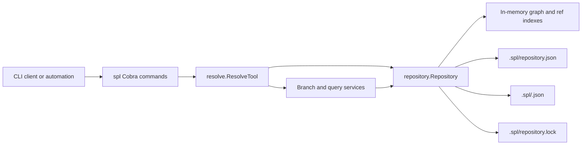

# Architecture

## Overview

Spool is a local, content-addressed version-control system for graph data. Its
only runtime interface is the `spl` command-line application. Commands produce
JSON on standard output for machine integration; errors are structured JSON
logs on standard error.

The CLI discovers the nearest parent `.spl` directory. `spl init` creates it;
subsequent commands open the existing repository, acquire its process lock,
perform the operation, persist any state change, and release the lock at
process exit.

## Components

| Component | Responsibility |
| --- | --- |
| `cmd/spl` | Cobra command definitions, flag and argument validation, repository discovery, JSON output, and error logging. |
| `internal/resolve` | Context-aware, policy-constrained adapter for graph queries and command-facing operations. It applies query budgets and pins a branch before resolution. |
| `internal/repository` | Authoritative graph storage, commits, branches, staging, query implementations, durable state, locking, and recovery. |
| `internal/repository/branch` | Branch request validation and lifecycle service boundary. |
| `internal/repository/initialization` | Repository initialization service boundary. |
| `internal/repository/merge` | Merge transaction lifecycle service boundary. The repository supplies its durable, atomic store contract. |

## Data model

The repository is an immutable graph history:

- A **node** has an ID, compatibility title, sorted labels, and typed properties;
  an **edge** has an ID, source node, target node, type, and typed properties.
- A property value is explicitly tagged as `null`, `bool`, `integer`, `float`,
  `string`, `list`, or `map`. Lists and string-keyed maps recursively contain
  property values; labels are normalized to sorted, unique values.
- A **snapshot** references independently content-addressed node, edge,
  outgoing-adjacency, incoming-adjacency, and schema roots.
- Every seeded snapshot references the built-in versioned permissive schema.
  It records the schema version but deliberately imposes no label, edge-type,
  or property validation. Schema authoring, migrations, and enforcement are not
  currently part of Spool.
- A **commit** references a snapshot and zero or more parent commits, with
  author, message, and timestamp metadata.
- A **branch** is a mutable reference to a commit. One default branch (`main`)
  and one active branch are recorded.
- A branch may have one durable **staged mutation set**, validated against its
  base commit before it is materialized into a new snapshot and commit.

Objects are encoded with canonical CBOR. Their IDs are BLAKE3 hashes of a
type-and-length header plus encoded value, so equivalent objects receive the
same identifier. JSON state stores the object index and the graph projections
used for efficient node and edge access. On open, the persisted state is
validated against the canonical objects and roots before it is accepted.

## Primary flows

### Write flow

1. `spl add` submits a complete mutation batch for a branch.
2. `Repository.StageMutationBatch` validates graph invariants, notably unique
   operations and valid edge endpoints, then atomically replaces that branch's
   staged set.
3. `spl commit` verifies that staging still targets the branch head,
   materializes sorted graph roots and a new snapshot, creates a commit, moves
   the branch ref, clears staging, and persists the new state.

Branch creation, deletion, and switching update the same repository state.
Destructive branch operations protect the default and active branches.

Mutation batches are JSON arrays. Node operations may include `labels` and a
`properties` object; edge operations may include `type` and `properties`. Each
property value uses its explicit `kind` and corresponding value field, such as
`{"kind":"integer","integer":3}` or a recursive
`{"kind":"list","list":[{"kind":"string","string":"critical"}]}`. The
built-in schema accepts these fields without user-authored constraints.

### Read flow

`resolve` pins the selected branch to an immutable commit before reading a
node. This makes the returned node, commit, snapshot root, and projection root
internally consistent if the branch moves concurrently. `diff`, `history`,
branch-containment, and impact queries read immutable snapshots through the
same repository layer. Diff and impact requests have row, response-size, depth,
or visited-node budgets; diff pagination tokens bind the continuation to the
exact comparison request.

### Merge flow

Merge operations are modeled as transactions bound to the source, target, and
merge-base commits that were previewed. A clean merge advances the target
directly. A conflicted merge records a target-branch lease and durable
transaction state; the owner must resolve, restage, and finalize it. Repository
open recovers valid transactions and discards invalid or stale records.

## Durability and concurrency

`Repository` uses an in-process read/write mutex and a `.spl/repository.lock`
file to prevent concurrent processes from mutating the same local repository.
State writes use a synced temporary file followed by an atomic replacement and
directory sync. Operations roll back in-memory changes when persistence fails
before replacement; when replacement succeeds but final directory sync fails,
they return a result together with a durability warning so callers do not treat
a committed write as failed.

## Extension points and current scope

The repository package is the storage authority. New lifecycle behavior belongs
there or in a focused service package with an explicit repository contract.
`resolve` is deliberately a query/tool adapter rather than another storage
layer. Spool currently operates locally: there is no network transport,
authentication service, remote synchronization, or server-side component.
