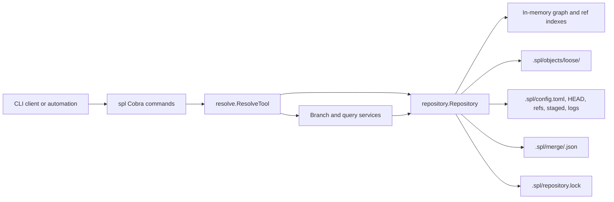

# Architecture

## Overview

Spool is a local, content-addressed version-control system for graph data. Its
only runtime interface is the `spl` command-line application. Commands produce
JSON on standard output for machine integration; errors are structured JSON
logs on standard error.

The CLI discovers the nearest parent `.spl` directory. `spl init` creates it;
subsequent commands open the existing repository, acquire its process lock,
perform the operation, persist any state change, and release the lock at
process exit.

## Components

| Component | Responsibility |
| --- | --- |
| `cmd/spl` | Cobra command definitions, flag and argument validation, repository discovery, JSON output, and error logging. |
| `internal/resolve` | Context-aware, policy-constrained adapter for graph queries and command-facing operations. It applies query budgets and pins a branch before resolution. |
| `internal/repository` | Authoritative graph storage, commits, branches, staging, query implementations, durable state, locking, and recovery. |
| `internal/repository/branch` | Branch request validation and lifecycle service boundary. |
| `internal/repository/initialization` | Repository initialization service boundary. |
| `internal/repository/merge` | Merge transaction lifecycle service boundary. The repository supplies its durable, atomic store contract. |

## Data model

The repository is an immutable graph history:

- A **node** has an ID, compatibility title, sorted labels, and typed properties;
  an **edge** has an ID, source node, target node, type, and typed properties.
- A property value is explicitly tagged as `null`, `bool`, `integer`, `float`,
  `string`, `list`, or `map`. Lists and string-keyed maps recursively contain
  property values; labels are normalized to sorted, unique values.
- A **snapshot** references independently content-addressed node, edge,
  outgoing-adjacency, incoming-adjacency, and schema roots.
- Every seeded snapshot references the built-in versioned permissive schema.
  It records the schema version but deliberately imposes no label, edge-type,
  or property validation.
- Later schema versions may define node-label and edge-type property rules,
  edge endpoint labels and cardinality, natural-key uniqueness, and supported
  graph-wide invariants. Schema definitions are normalized and
  content-addressed just like graph data.
- A **commit** references a snapshot and zero or more parent commits, with
  author, message, and timestamp metadata.
- A **branch** is a mutable reference to a commit. One default branch (`main`)
  and one active branch are recorded.
- A branch may have one durable **staged mutation set**, validated against its
  base commit before it is materialized into a new snapshot and commit.

Every immutable object is encoded with canonical CBOR. Its ID is the BLAKE3
hash of a type-and-length header plus those bytes, and it is stored as a
canonical CBOR envelope at `.spl/objects/loose/<first-two-hex>/<rest>`.
Equivalent objects therefore have the same ID; a type, hash, envelope, or
payload mismatch is corruption.

Nodes, edges, and the node, edge, outgoing-adjacency, and incoming-adjacency
indexes are immutable objects. Indexes are fixed-fanout (32) sorted Prolly
trees: leaves contain key/object-ID pairs and internal nodes contain each
child's last key. A snapshot names the four tree roots and schema root.
Repositories reconstruct their in-memory projections only from those roots on
open and reject non-canonical objects, malformed trees, invalid adjacency, or
schema-invalid reachable graphs.

Mutable state is intentionally separate from immutable objects:

- `config.toml` records the format and default branch; `HEAD` records the
  active branch.
- `refs/heads/<branch>` maps each branch name to a commit ID.
- `staged/<branch>.json` is that branch's complete staged replacement set.
- `logs/` records ref and HEAD transitions after the corresponding replacement.
- `merge/` contains owner-gated unresolved merge transactions.

The old monolithic `.spl/repository.json` format is rejected rather than
migrated implicitly.

## Primary flows

### Write flow

1. `spl add` submits a complete mutation batch for a branch.
2. `Repository.StageMutationBatch` validates graph invariants, notably unique
   operations and valid edge endpoints, then atomically replaces that branch's
   staged set.
3. `spl commit` verifies that staging still targets the branch head,
   writes all node, edge, tree, schema, snapshot, and commit objects, then
   atomically moves the branch ref and clears staging.

### Schema migration and validation

`spl schema migrate --branch <branch> --schema <file> --batch <file>` authors a
target schema in TOML and supplies the complete JSON mutation batch needed to
move the base graph to that schema. TOML supports `version`, optional
`permissive`, `global_invariants`, repeated `[[node]]` and `[[edge]]` rules,
their repeated `[[node.property]]` and `[[edge.property]]` rules, and an
edge's `[edge.cardinality]` table. Unknown TOML fields are rejected.

The repository parses and normalizes the schema, applies the mutation batch to
the selected branch head in memory, and validates the resulting full graph
against the target schema. Only if all of that succeeds does it atomically
replace the branch's staged mutation set with both the operations and target
schema. A normal `spl commit` then materializes one snapshot and commit
containing both changes. A rejected migration leaves the prior staged set
unchanged; migration staging itself does not change historical snapshots.

`spl validate --branch <branch> [--commit <commit>]` selects exactly one
immutable snapshot and returns a JSON conformance report with the snapshot and
schema metadata plus any violations. Without `--commit`, it pins the branch
head before validation. An explicit commit must satisfy the same reachable-from
the-selected-branch policy as `resolve`; it cannot select an unrelated
detached commit by default.

Branch creation, deletion, and switching atomically update their individual
control files. Destructive branch operations protect the default and active
branches.

Mutation batches are JSON arrays. Node operations may include `labels` and a
`properties` object; edge operations may include `type` and `properties`. Each
property value uses its explicit `kind` and corresponding value field, such as
`{"kind":"integer","integer":3}` or a recursive
`{"kind":"list","list":[{"kind":"string","string":"critical"}]}`. The
built-in schema accepts these fields without user-authored constraints.

### Read flow

`resolve` and `validate` pin the selected branch to an immutable commit before
reading. This makes their returned metadata and data or validation report
internally consistent if the branch moves concurrently. `diff`, `history`,
branch-containment, and impact queries read immutable snapshots through the
same repository layer. Diff and impact requests have row, response-size, depth,
or visited-node budgets; diff pagination tokens bind the continuation to the
exact comparison request.

### Merge flow

`spl merge preview` computes a deterministic three-way comparison of the base,
source, and target snapshots without moving refs. It merges independent node and
edge fields and top-level property keys, and reports structural, schema, and
schema-derived semantic conflicts with stable IDs and affected paths. A clean
preview has a content-derived identifier. `spl merge apply` recomputes that exact
preview, materializes its merged graph snapshot, creates a two-parent commit, and
advances the target atomically.

Applying a conflicted exact preview persists the preview in an owner-gated merge
transaction and leases its target branch. `spl merge conflicts` reads that durable
preview; `spl merge resolve` requires one source-or-target selection for every
reported conflict and may apply a validated mutation override batch. It stores a
schema-valid resolution snapshot without advancing the target. `spl merge finalize`
revalidates the original preview binding and atomically creates the two-parent
commit; `spl merge abort` removes the transaction and lease. Transactions survive
restart only when their persisted binding and preview remain valid.

## Durability and concurrency

`Repository` uses an in-process read/write mutex and a `.spl/repository.lock`
file to prevent concurrent processes from mutating the same local repository.
Each immutable object is made durable before a mutable ref can point to it.
Control-file writes use a synced temporary file, atomic replacement, and
directory sync. A ref transition is recorded in its reflog only after its
replacement has succeeded. Staging cleanup follows a successful commit-ref
replacement, so an interruption can retain safe, stale staging but cannot make
a ref name a missing object. Unreachable immutable objects left by an
interrupted transition are safe and may be collected by a future maintenance
operation.

Operations roll back in-memory changes when persistence fails before
replacement. When replacement succeeds but the final directory sync or reflog
append fails, they return a result with a durability warning: callers must not
retry as though the transition did not happen.

### Integrity checking

`spl fsck` is read-only and emits a complete JSON report. It verifies control
files, refs, staged state, merge bindings, every reachable commit and snapshot,
all Prolly-tree ordering and boundaries, graph/schema invariants, and every
loose-object envelope (including unreachable objects). It returns a non-zero
status for corruption while still writing the report, so automation can retain
the diagnostics. `fsck` does not repair or delete data.

## Extension points and current scope

The repository package is the storage authority. New lifecycle behavior belongs
there or in a focused service package with an explicit repository contract.
`resolve` is deliberately a query/tool adapter rather than another storage
layer. Spool currently operates locally: there is no network transport,
authentication service, remote synchronization, or server-side component.
