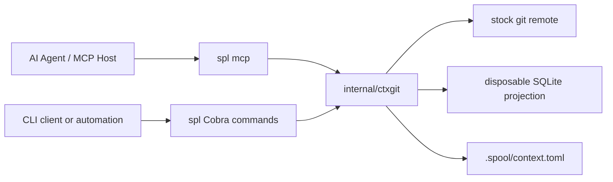

# Architecture

## Overview

Spool's public product is **bound context git**. Solution context lives as human-diffable node,
edge, schema, and asset files in a git remote. Git is the durable source of truth. A local SQLite
projection is rebuilt from the checkout, is never committed, and is never the source of truth.

The runtime exposes two interfaces: the `spl` command-line application and a native Model Context
Protocol server (`spl mcp`). Both register the KEEP surface only. Successful commands emit JSON on
stdout; failures are structured JSON logs on stderr.

A workspace is bound when `.spool/context.toml` exists with `solution_id`, `remote`, and
`protected_branch`. Context-management commands call `FindBind` and fail closed when unbound.
Remotes are never inferred from directory names or leftover `.spl` state.

Mutations write a short-lived `spool/mcp/<stamp>-<nonce>` branch and open a pull request into the
protected branch. They never push the protected branch except `spl context init` onboarding.

Private `.spl` readers remain only for `spl context export` / `migrate-once`. They are not public
VCS commands and do not reopen Rack or `.spl` as source of truth.

## Components

| Component | Responsibility |
| --- | --- |
| `cmd/spl` | KEEP Cobra commands. The `context` namespace is init/export/migrate-once only. Graph queries use `query-context`. |
| `internal/mcp` | KEEP MCP tools (20) over stdio. No Rack/workspace twins of removed commands. |
| `internal/ctxgit` | Bind file, checkout, graph load/store, projection rebuild, short-lived branch + PR writes (including `mutate`), bound queries, file-graph merge, graph prune, leftover `.spl` export. |
| `internal/resolve` | Query-budget and retrieval result shapes used by bound ctxgit reads. |
| `internal/contextual` | Direction and evidence-expansion types used by `query-context` / `search-expand`. |
| `internal/repository` | **Private library.** Historical CAS/Rack graph storage. No public CLI/MCP wrappers. Used internally by leftover `.spl` export. |
| `internal/workspace`, `internal/remote` | **Private libraries.** Not exposed as commands. |

## CLI and MCP KEEP surface

`spl --help` and MCP `tools/list` advertise only:

| Group | Commands / tools |
| --- | --- |
| Happy path | `context init` (`--remote`), `context export` / `migrate-once`, `mcp`, `version` / `help` / `completion` |
| Bound reads | `search`, `search-expand`, `filter`, `resolve`, `graph`, `query-context` |
| Bound writes | `mutate`, `schema migrate`, `validate`, `asset add` / `read`, `merge *` (file-graph), `prune` |

The former query verb `context` is **`query-context`** (MCP: `spl_query_context`). There is no alias.

### Removed (deleted from CLI and MCP; no aliases)

`init`, `workspace *`, `remote *`, `push`, `pull`, `clone`, old `migrate`, `fsck`, `gc`, pack prune,
`cherry-pick`, `add`, `status`, `commit`, `branch`, `switch`, `history`, `diff`,
`branches-containing`, and all Rack/workspace MCP twins (`spl_add`, `spl_commit`, `spl_init`,
`spl_context`, `spl_push`, …).

History and snapshot comparison are **stock git** (`git log`, `git diff`) on the context remote.

## Data model (context git)

The bound checkout is a file graph:

- `schema.toml` — schema version, optional `permissive`, node/edge rules.
- `nodes/<namespaced-id>.json` — one node per file (ID, title, labels, properties).
- `edges/<namespaced-id>.json` — one edge per file (ID, source, target, type, properties).
- `assets/` — reference blobs; Asset nodes store locators.
- IDs are prefixed with `repository_id` unless they already contain `/`.

The SQLite projection indexes titles, labels, and schema-opted-in scalar properties for `search`
and `filter`. It is rebuilt after bind and after writes. It is never committed.

`Ephemeral` is the universal modifier label. `prune` deletes those nodes, cascades incident edges,
and reports durable orphans. It is graph cleanup, not pack/CAS GC.

## Primary flows

### Bind

`spl context init --remote <url>` writes `.spool/context.toml`, clones or seeds the remote layout,
and records a `CodeRepository` node for this code repo.

### Read (bound only)

`resolve`, `search`, `filter`, `graph`, `search-expand`, `query-context`, and `validate` open a
ctxgit session against the bind file, rebuild the projection if needed, and refuse unbound
workspaces.

### Write (short-lived branch + PR)

`mutate`, `schema migrate`, `asset add`, file-graph `merge apply` / `finalize`, and `prune` persist a
graph diff, `git add`, and:

- if the tree is clean, return a no-op on the protected branch (no empty PR);
- otherwise commit on a short-lived branch, push that branch only, and open a host PR.

### Export leftover `.spl`

`context export` opens a private `repository.Repository` against leftover `.spl` state and writes
namespaced nodes/edges through the same ctxgit commit/PR path. `migrate-once` skips when titles
already exist.

### File-graph merge

`merge preview` loads graphs at two git revisions (via `git archive`) and runs
`graphcontract.ThreeWayMerge`. Clean apply commits the merged files through ctxgit. Conflicted
state lives in the ctxgit cache directory, not `.spl/merge/`.

## Extension points

New public behavior belongs on `internal/ctxgit` and KEEP CLI/MCP registration. `internal/repository`
stays a private library: do not re-expose Rack, CAS packs, or `.spl` as source of truth.
