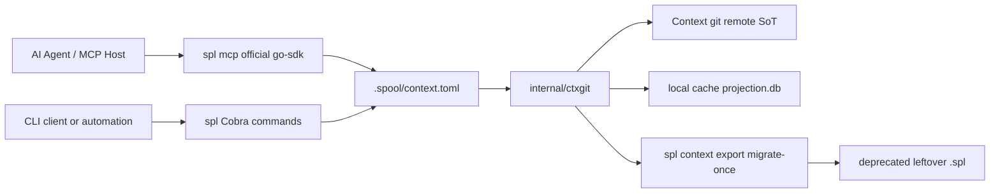

# Architecture

## Overview

Spool is the MCP/CLI tool for shared solution context. N code repositories bind
to **one** context git remote. **Git is the only durable source of truth.**
Spool validates mutations, writes human-diffable files, opens a short-lived
branch plus pull request, and rebuilds a local query projection. It provides
two runtime interfaces: the `spl` command-line application (for shell scripts,
manual usage, and CI) and a native Model Context Protocol (MCP) server running
via `spl mcp` using the official Go SDK (the primary interface for AI agents).
Commands produce JSON on standard output for machine integration; errors are
structured JSON logs on standard error.

The runtime requires an explicit `.spool/context.toml` bind to a solution
context git remote. Graph writes go to that remote as human-diffable files on a
short-lived branch plus pull request — never a clean push to the working or
protected branch. Auth is stock git credentials only. Local SQLite/FTS
projections rebuild from the current checkout on every MCP/process start and
are never source of truth.

Leftover `.spl` state is **deprecated / migration-only** (`spl context export`),
not a supported parallel SoT. An explicit `--state-dir` still selects leftover
local state for that export path, followed by `SPOOL_DIR`, then a validated
ancestor `.spl/config.toml` workspace manifest. Those `.spl` / Rack paths are
unsupported for solution context and are refused when a context bind is present.
There is no Rack module dependency on the default install path, no dual-run,
and no pack wire-compat.

## Components

| Component | Responsibility |
| --- | --- |
| `cmd/spl` | Cobra command definitions, flag and argument validation, bind-aware command gating, JSON output, and error logging. |
| `internal/ctxgit` | Explicit `.spool/context.toml` bind resolution, stock-git context checkout, human-diffable layout, short-lived branch + PR writes, local projection rebuild, and one-shot `.spl` export. Git is the **only** durable solution-context SoT. |
| `internal/mcp` | Native Model Context Protocol server exposing 43 typed tools over stdio using `github.com/modelcontextprotocol/go-sdk`, with serialized repository locking, in-memory mutation staging, and error envelopes. |
| `internal/resolve` | Context-aware, policy-constrained adapter for read-only graph queries. It applies query budgets, pins a branch snapshot, and exposes public retrieval results with provenance and completion metadata. |
| `internal/contextual` | Go use cases that combine branch-head lexical or typed-filter evidence with bounded, deterministic expansion of a pinned graph snapshot. |
| `internal/repository` | Leftover local `.spl` object storage used by migration/export and query internals. **Not** the shared solution-context SoT. |
| `internal/repository/branch` | Branch request validation and lifecycle service boundary. |
| `internal/repository/fsck` | Non-opening repository diagnostic and integrity verification service boundary. |
| `internal/repository/initialization` | Repository initialization service boundary. |
| `internal/repository/merge` | Merge transaction lifecycle service boundary. The repository supplies its durable, atomic store contract. |
| `internal/repository/prune` | Graph pruning and ephemeral node excision service boundary. |
| `internal/workspace` | Deprecated detached-workspace provisioning. Not the N→1 context bind; unsupported for solution context. |
| `internal/repository/asset` | Content-addressed reference-asset blob storage, locator parsing, MIME detection, and local cache lifecycle. |
| `internal/remote` | Leftover Rack client from the pre-git-SoT protocol. **Unsupported** for solution context: no Rack sync, no pack wire-compat, no dual-run. Default `spl` install has no `spool-rack` module dependency. |

## CLI command surface

The root `spl` command exposes a persistent `--state-dir` override plus Cobra's `--help`,
`completion`, and `help` commands. The application commands are grouped by their repository
operation:

| Group | Commands |
| --- | --- |
| Working changes | `add`, `status`, `commit` (`init` is deprecated / migration-only) |
| Branches | `branch create/list/delete`, `switch` |
| Schemas | `schema migrate`, `validate` |
| Reads | `resolve`, `graph`, `search`, `filter`, `search-expand`, `context` |
| Context bind | `context init` |
| Context export | `context export` (`migrate-once`) |
| History and comparison | `history`, `branches-containing`, `diff` |
| Merge lifecycle | `merge preview/apply/conflicts/resolve/finalize/abort` |
| Maintenance | `fsck`, `gc`, `prune` |
| Contextual assets | `asset add`, `asset read` |
| Detached workspaces | `workspace init/attach` (**deprecated / unsupported** for solution context) |
| Legacy Rack (unsupported) | `remote`, `push`, `pull`, `clone` — fail closed when bound; MCP always refuses |

The complete syntax, flags, examples, and selector constraints are maintained in
`.agents/skills/spool/references/cli-help.md`. In particular, mutation staging and schema
migration replace a branch's staged set atomically; read-command branch and commit selectors pin
immutable snapshots; projection retrieval is branch-head-only; and merge conflicts are handled through a
durable target-branch lease. All successful operational commands emit JSON on stdout, while
operational failures are structured JSON logs on stderr.

## Data model

The repository is an immutable graph history:

- A **node** has an ID, compatibility title, sorted labels, and typed properties;
  an **edge** has an ID, source node, target node, type, and typed properties.
- A property value is explicitly tagged as `null`, `bool`, `integer`, `float`,
  `string`, `list`, or `map`. Lists and string-keyed maps recursively contain
  property values; labels are normalized to sorted, unique values.
- A **snapshot** references independently content-addressed node, edge,
  outgoing-adjacency, incoming-adjacency, and schema roots.
- Every seeded snapshot references the built-in versioned permissive schema.
  It records the schema version but deliberately imposes no label, edge-type,
  or property validation.
- Later schema versions may define node-label and edge-type property rules,
  edge endpoint labels and cardinality, natural-key uniqueness, and supported
  graph-wide invariants. Schema definitions are normalized and
  content-addressed just like graph data. Scalar node property rules may set
  `indexed = true` to opt into the private SQLite typed-property indexes.
- A **commit** references a snapshot and zero or more parent commits, with
  author, message, and timestamp metadata.
- A **branch** is a mutable reference to a commit. One default branch (`main`)
  and one active branch are recorded.
- A branch may have one durable **staged mutation set**, validated against its
  base commit before it is materialized into a new snapshot and commit.

Every immutable object is encoded with canonical CBOR. Its ID is the BLAKE3
hash of a type-and-length header plus those bytes. Durable representations use
the same canonical CBOR envelope: loose objects are stored at
`state-dir/objects/loose/<first-two-hex>/<rest>`, while commits publish newly
materialized objects together in one append-only pack before atomically moving
the branch ref. Equivalent objects therefore have the same ID; a type, hash,
envelope, or payload mismatch is corruption. Loose objects remain supported
for repository initialization, direct object storage, and maintenance
compatibility, and are the first durable lookup location. If absent there,
reads consult the atomically published
`objects/info/packs` manifest, then the manifest-listed immutable
`objects/pack/<generation>.pack` files and their indexes. Pack entries contain
the same canonical envelope, compressed with zstd and checked by their CRC,
envelope, type, and object ID; packing never changes an object's identity.

Nodes, edges, and the node, edge, outgoing-adjacency, and incoming-adjacency
indexes are immutable objects. Indexes are fixed-fanout (32) sorted Prolly
trees: leaves contain key/object-ID pairs and internal nodes contain each
child's last key. A snapshot names the four tree roots and schema root.
Repositories reconstruct their in-memory projections only from those roots on
open and reject non-canonical objects, malformed trees, invalid adjacency, or
schema-invalid reachable graphs.

Mutable state is intentionally separate from immutable objects:

- `config.toml` records the format and default branch; `HEAD` records the
  active branch.
- `refs/heads/<branch>` maps each branch name to a commit ID.
- `staged/<branch>.json` is that branch's complete staged replacement set.
- `logs/` records ref and HEAD transitions after the corresponding replacement.
- `merge/` contains owner-gated unresolved merge transactions.
- `graph.db` is a versioned, private SQLite/FTS5 projection. It is never
  canonical state: its metadata records the selected branch head, node-root
  watermark, schema version, and `building`, `ready`, or `failed` state.
  Repository open rebuilds it from canonical objects when it is absent,
  incompatible, corrupt, or stale. It indexes node titles, labels, and
  top-level string properties for FTS; only schema-opted-in scalar properties
  enter typed filter indexes.

The old monolithic `.spl/repository.json` format is rejected rather than
migrated implicitly.

Reference assets are immutable, content-addressed blobs stored separately from graph objects
under `state-dir/assets/loose/<first-two-hex>/<rest>`. An Asset graph node records the canonical
`spool://assets/<hash>` locator, byte size, MIME type, and optional original filename. Asset blobs
are not embedded in graph snapshots or commit packs. `spl asset add` writes and stages the blob
with the branch's staged mutation set; bound workspaces store assets in the context git
tree (Git LFS at or above 512 KiB; text/JSON/TOML stay plain git). `spl asset read`
streams a blob from the bound checkout. Rack on-demand retrieval is unsupported for
solution context.

## Primary flows

### Write flow

1. `spl add` submits a complete mutation batch for a branch.
2. `Repository.StageMutationBatch` validates graph invariants, notably unique
   operations and valid edge endpoints, then atomically replaces that branch's
   staged set.
3. `spl commit` verifies that staging still targets the branch head,
   batches all node, edge, tree, schema, snapshot, and commit objects into one
   pack, atomically publishes that pack, then atomically moves the branch ref
   and clears staging.

### Schema migration and validation

`spl schema migrate --branch <branch> --schema <file> --batch <file>` authors a
target schema in TOML and supplies the complete JSON mutation batch needed to
move the base graph to that schema. TOML supports `version`, optional
`permissive`, `global_invariants`, repeated `[[node]]` and `[[edge]]` rules,
their repeated `[[node.property]]` and `[[edge.property]]` rules, and an
edge's `[edge.cardinality]` table. Unknown TOML fields are rejected.

The repository parses and normalizes the schema, applies the mutation batch to
the selected branch head in memory, and validates the resulting full graph
against the target schema. Only if all of that succeeds does it atomically
replace the branch's staged mutation set with both the operations and target
schema. A normal `spl commit` then materializes one snapshot and commit
containing both changes. A rejected migration leaves the prior staged set
unchanged; migration staging itself does not change historical snapshots.
The resulting schema also controls which scalar node properties are emitted to
the derived typed-property indexes.

`spl validate --branch <branch> [--commit <commit>]` selects exactly one
immutable snapshot and returns a JSON conformance report with the snapshot and
schema metadata plus any violations. Without `--commit`, it pins the branch
head before validation. An explicit commit must satisfy the same reachable-from
the-selected-branch policy as `resolve`; it cannot select an unrelated
detached commit by default.

Branch creation, deletion, and switching atomically update their individual
control files. Destructive branch operations protect the default and active
branches.

Mutation batches are JSON arrays. Node operations may include `labels` and a
`properties` object; edge operations may include `type` and `properties`. Each
property value uses its explicit `kind` and corresponding value field, such as
`{"kind":"integer","integer":3}` or a recursive
`{"kind":"list","list":[{"kind":"string","string":"critical"}]}`. The
built-in schema accepts these fields without user-authored constraints.

### Read flow

`resolve`, `validate`, and every retrieval operation pin the selected branch to
an immutable commit before reading. This makes their returned metadata and data
or validation report internally consistent if the branch moves concurrently.
`diff`, `history`, branch-containment, and impact queries read immutable
snapshots through the same repository layer. Diff and impact requests have row,
response-size, depth, or visited-node budgets; diff pagination tokens bind the
continuation to the exact comparison request.

`search` reads deterministic lexical pages from the projection's FTS5 index and
returns ranking, matched fields, and snippets. `filter` combines labels with
schema-enabled scalar text equality or numeric equality/range predicates.
`search-expand` and `context` use either lexical or typed-filter evidence as
seeds, then follow selected incoming, outgoing, or both directions with optional
edge-type filters. They return deterministic supporting paths, nodes, and edges;
`context` prioritizes evidence in its response. All retrieval responses include
the pinned snapshot, projection metadata, effective budgets, and explicit
completion/truncation metadata. Continuation tokens bind projection pages to
their exact request.

The SQLite projection is branch-head-only. It is rebuilt against the selected
active head after commits, active-branch switches, and completed merges.
Historical or divergent snapshots are deliberately rejected for projection-backed
retrieval; future snapshot-selector work will add an explicit historical
projection cache.

### Merge flow

`spl merge preview` computes a deterministic three-way comparison of the base,
source, and target snapshots without moving refs. It merges independent node and
edge fields and top-level property keys, and reports structural, schema, and
schema-derived semantic conflicts with stable IDs and affected paths. A clean
preview has a content-derived identifier. `spl merge apply` recomputes that exact
preview, materializes its merged graph snapshot, creates a two-parent commit, and
advances the target atomically.

Applying a conflicted exact preview persists the preview in an owner-gated merge
transaction and leases its target branch. `spl merge conflicts` reads that durable
preview; `spl merge resolve` requires one source-or-target selection for every
reported conflict and may apply a validated mutation override batch. It stores a
schema-valid resolution snapshot without advancing the target. `spl merge finalize`
revalidates the original preview binding and atomically creates the two-parent
commit; `spl merge abort` removes the transaction and lease. Transactions survive
restart only when their persisted binding and preview remain valid.

## Durability and concurrency

`Repository` uses an in-process read/write mutex and a `state-dir/repository.lock`
file to prevent concurrent processes from mutating the same repository.
Each immutable object is made durable before a mutable ref can point to it.
Projection maintenance runs after the canonical transition. A projection failure
does not roll back a durable commit or ref; it remains visible as a failed
derived state and is rebuilt at the next repository open.
Control-file writes use a synced temporary file, atomic replacement, and
directory sync. Before a ref transition can succeed, its canonical reflog path
is atomically recorded in the durable `reflog-retention` inventory; a ref
transition is then recorded in that reflog only after replacement has
succeeded. The inventory is an append-only set of `HEAD` and
`refs/heads/<name>` paths, so a deleted branch's historical reflog remains a
root. Staging cleanup follows a successful commit-ref replacement, so an
interruption can retain safe, stale staging but cannot make a ref name a
missing object. Unreachable immutable objects left by an interrupted
transition are safe and may be collected by a future maintenance operation.

Operations roll back in-memory changes when persistence fails before
replacement. When replacement succeeds but the final directory sync or reflog
append fails, they return a result with a durability warning: callers must not
retry as though the transition did not happen.

### Object maintenance

`spl gc` runs while the opened repository holds its normal process lock and
in-process mutation lock. Its retention roots are every branch ref, both the
old and new object IDs in every reflog entry, and a resolved durable merge
transaction's staged snapshot. It reads only reflogs listed by the retention
inventory and fails closed if the inventory, a listed file, or the exact set of
on-disk reflog paths is invalid. Existing repositories bootstrap this inventory
from their currently present legitimate logs on first open; deleted or
truncated logs from before that migration cannot be reconstructed. Reflogs are
retained indefinitely because their current format has no timestamps. Objects
not reachable from those roots remain loose for a 14-day grace period before
pruning.

GC writes and syncs a new pack and index, fully reopens and verifies them, then
atomically replaces the active-pack manifest and syncs its directory. Only
after that publication can matching loose copies be removed. Repacking first
publishes one replacement generation and then retires superseded pack files.
Thus a crash before manifest publication leaves only ignored, collectible pack
artifacts; a crash after publication leaves the new complete generation
readable even if loose or old-pack cleanup has not completed. Cleanup failures
after publication are reported as committed-with-warning results rather than
safe-to-retry failures.

### Integrity checking

`spl fsck` is read-only and emits a complete JSON report. It verifies control
files, refs, the reflog-retention inventory and its exact listed log set,
staged state, merge bindings, every reachable commit and snapshot, all
Prolly-tree ordering and boundaries, graph/schema invariants, and every
loose-object envelope (including unreachable objects). It also validates the
active pack manifest, every listed pack and index, entry offsets, compression
CRC, and packed envelope/type/hash before resolving reachable objects from
either storage location. Matching loose and packed copies must agree. Unreachable
valid loose objects are reported as informational GC candidates and do not make
the report invalid. `fsck` returns a non-zero status for corruption while still
writing the report, so automation can retain the diagnostics; it never repairs
or deletes data.

## Multi-repo workspaces

`internal/workspace` leftover detached-state provisioning is **deprecated** and
unsupported for solution context. N code repos bind to one context git remote
via `.spool/context.toml`, not via `.spl` workspace manifests.

## Extension points and current scope

Solution context is stored in git via `internal/ctxgit`. That is the **only**
durable SoT. The repository package remains leftover `.spl` storage for
migrate-once export and query internals — not a parallel VCS. Rack wire
transport, pack wire-compat, and dual-run are non-goals. New lifecycle
behavior for solution context belongs in `ctxgit/`. `resolve` is deliberately a
query/tool adapter rather than another storage layer, and `contextual` owns
bounded evidence-and-expansion use cases rather than projection persistence.

One-shot `.spl` → context git export is the documented escape hatch
(`spl context export` / `spl_context_export`): keep nodes/edges/schema/assets,
drop packs/Rack remotes/reflogs/merge leases/projections, one batch → one
commit → PR. Re-run is overwrite-at-own-risk. See
[context-git-migration.md](context-git-migration.md).
