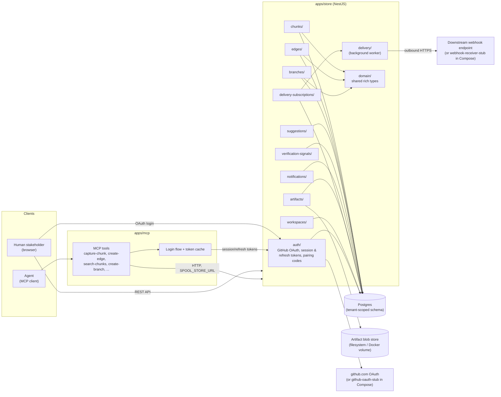

# Spool High-Level Architecture

> This document describes the architecture **as implemented** in this repository. It is
> descriptive, not authoritative: per `docs/constitution.md` ("Meridian authority"), Spool has no
> local functional or technical specifications, and a linked Meridian workspace is the sole
> authoritative source for product and architecture *direction*. If this document and Meridian
> disagree, Meridian wins. Update this document when the implementation changes, rather than
> treating it as a design spec to build toward.

## 1. System Overview

Spool turns stakeholder chat into approved implementation context. It captures conversations as
atomic idea "chunks," links them with typed relationships into a graph, and carries each chunk
through a `draft -> approved -> promoted` lifecycle. Documents and other artifacts are generated
projections of the graph — the graph itself is the source of truth, not any document derived from
it.

The system is a TypeScript/NestJS monorepo managed with pnpm workspaces, composed of two
deployable applications plus shared, non-application tooling and configuration:

```
apps/store   NestJS knowledge store API (Postgres-backed)
apps/mcp     MCP server for agent-facing interactions with the store
tools/       Shared scripts, codegen, CLI helpers (not imported by apps/)
config/      Shared environment templates consumed by apps and Docker Compose
docs/        Engineering constitution and per-goal decision records
```

## 2. Component Diagram



## 3. Component Architecture

### 2.1 `apps/store` — the knowledge store

`apps/store` is the single source of truth. It is a NestJS application organized as vertical
slices (per Constitution Principle III), each owning its controller, DTOs, service, domain logic,
and tests for one capability:

| Slice                     | Responsibility                                                                 |
| ------------------------- | ------------------------------------------------------------------------------ |
| `chunks/`                 | Atomic idea chunk capture and lifecycle (`draft -> approved -> promoted`).      |
| `edges/`                  | Typed relationships between chunks, forming the knowledge graph.                |
| `branches/`               | Scoped authoring branches, submission, and verification workflow.               |
| `suggestions/`            | Suggestion/feedback-loop capture on chunks and branches.                        |
| `verification-signals/`   | Stakeholder verification signals recorded against branches.                     |
| `notifications/`          | Feedback/notification delivery to stakeholders.                                 |
| `artifacts/`              | Artifact upload, storage, and retrieval, attached to chunks.                    |
| `delivery-subscriptions/` | Downstream consumer webhook subscriptions.                                      |
| `delivery/`               | Background worker that executes outbound delivery to subscribed webhooks.       |
| `workspaces/`             | Tenant/workspace registry and membership.                                       |
| `auth/`                   | GitHub OAuth login, session tokens, refresh tokens, pairing codes.               |
| `domain/`                 | Shared rich domain types (actors, vocabulary) used across slices.               |
| `persistence/`            | Postgres schema, migrations, and query/repository infrastructure.               |

Cross-cutting infrastructure (persistence, auth, domain types) exists to support these slices, not
to pull business logic into generic service layers — new behavior is added inside the slice that
owns the capability.

**Persistence.** All domain data is tenant-scoped in Postgres. Schema evolves through sequential,
numbered SQL migrations under `apps/store/src/persistence/migrations/` (currently `0001`–`0018`),
covering chunk capture, stakeholders, branches, edges, OAuth/session fixtures, suggestions,
artifacts, verification signals, feedback notifications, workspaces, workspace-scoping of prior
tables, delivery subscriptions/attempts, refresh tokens, and pairing codes. This sequence reflects
the order tenancy and auth were layered onto an initially single-tenant schema.

**Runtime.** The store runs as a container (`apps/store/Dockerfile`) alongside Postgres via Docker
Compose (`compose.yaml`), not directly on the host, per Constitution Principle II. `compose.debug.yaml`
additionally provisions two stub services used only for local/e2e verification: a GitHub OAuth stub
(`github-oauth-stub`) that stands in for `github.com`'s token exchange and `/user` endpoint, and a
TLS-terminating webhook receiver stub (`webhook-receiver-stub`) that the delivery worker calls to
prove a genuine outbound HTTPS handshake. `docker compose up --build` copies the host's
pre-built `apps/store/dist/` into the image, so `pnpm --filter store build` must run first.

### 2.2 `apps/mcp` — the agent-facing MCP server

`apps/mcp` is a Model Context Protocol server that lets agents (not humans) discover, manage, and
approve chunks and relationships without giving them direct API/database access. It talks to
`apps/store` over HTTP (`SPOOL_STORE_URL`) and exposes one MCP tool per store capability under
`apps/mcp/src/tools/`:

- `capture-chunk`, `create-edge`, `search-chunks`, `get-neighbourhood`
- `create-branch`, `submit-suggestion`, `submit-verification-signal`
- `attach-artifact-to-chunk`, `upload-artifact`

`apps/mcp/src/auth/` implements the agent-side login flow and a token cache, so an MCP client
authenticates once (via the store's OAuth flow) and reuses/refreshes a session for subsequent tool
calls, rather than re-authenticating per call.

### 2.3 Domain model

Per Constitution Principle IV, core concepts are modeled as rich types rather than primitive data
bags: tenants/workspaces, idea chunks, lifecycle states, typed edges/relationships, branches,
actors, and generated projections all carry behavior and invariants in `apps/store/src/domain/`
and their owning slices, rather than being validated only at the controller/DTO boundary.

## 4. Cross-Cutting Concerns

- **Tenancy.** Chunks, edges, branches, and related domain tables are workspace-scoped
  (`0013_add_workspace_id_to_domain_tables.sql`); requests are authorized and filtered per
  workspace membership.
- **Authentication.** GitHub OAuth is the identity provider for human stakeholders. The store
  issues its own session and refresh tokens (HMAC-signed) after OAuth login, and supports a
  pairing-code flow so non-browser clients (e.g., the MCP server) can obtain a session without a
  redirect-based OAuth dance.
- **Lifecycle and branching.** Chunks move `draft -> approved -> promoted`. Authoring happens on
  branches scoped to a discipline; branch state moves `draft -> submitted -> verified` (or back to
  `draft` on rejection). Submission requires the actor's discipline to match the branch; any human
  stakeholder can verify or reject regardless of discipline.
- **Delivery.** Downstream systems register HTTPS webhook subscriptions
  (`delivery-subscriptions/`); a background worker (`delivery/`) executes outbound delivery
  attempts against those subscriptions asynchronously from the request path.
- **Artifacts.** Binary/document artifacts are stored through an `ArtifactBlobStore` port backed
  by local-filesystem storage on a Docker-named volume in Compose, decoupling the blob storage
  mechanism from the artifact domain logic.

## 5. Quality Gates

Repository-wide checks — `pnpm build`, `pnpm typecheck`, `pnpm test` — must pass for any change,
run from the repo root. Each app also has its own `AGENTS.md` with structure and testing detail.
Tests use Vitest (not Jest) and follow the constitution's TDD blue/green/refactor loop, with the
store's API-level behavior validated against the containerized Postgres setup rather than mocked
substitutes where runtime dependencies are involved.

## 6. Non-Goals of This Document

This document intentionally does not define future architecture, propose new components, or
restate product direction. Product and architecture *decisions* live in the linked Meridian
workspace; `docs/goals/` records which vertical slice was selected from Meridian's direction, in
what order, and why — it does not substitute for Meridian as the source of direction, and neither
does this document.
