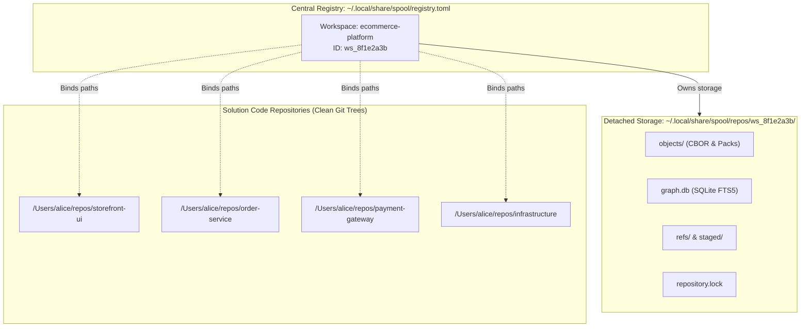
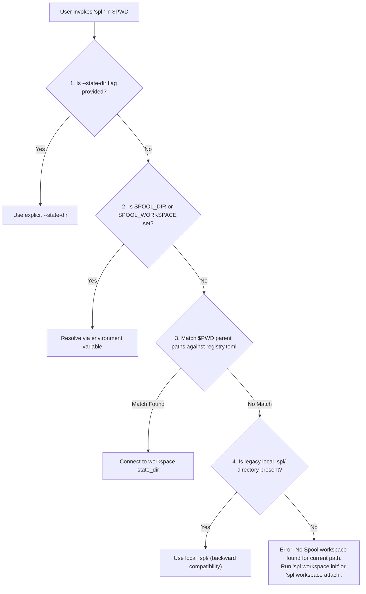
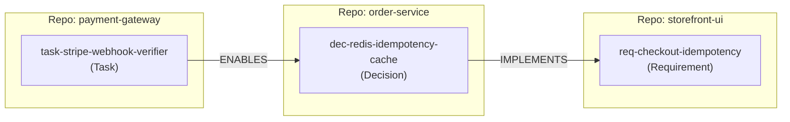

# Multi-Repository Workspaces & Detached State Storage

This document outlines the architecture, data models, discovery mechanics, and CLI workflows for managing **Multi-Repository Spool Workspaces** with **Detached State Storage**.

---

## 1. Background: The "Double VCS" Problem

When `spl init` initializes a `.spl/` state directory directly within a code repository's working tree, it creates a dual-VCS collision if that repository is already tracked by Git:

```text
my-project/
├── .git/                      <-- Git tracks line-based code diffs
├── .spl/                      <-- Spool internal engine (VCS #2)
│   ├── objects/               <-- Binary CBOR blobs and zstd packfiles
│   ├── graph.db               <-- SQLite / FTS5 projection databases
│   ├── repository.lock        <-- OS file locks
│   └── refs/heads/            <-- Mutable branch pointers
└── src/
```

### Why This Fails
1. **Binary & Lock Churn**: Git attempts to track Spool's internal database files, locks, and projections, creating dirty working tree diffs on every graph query or commit.
2. **Branch & State Desynchronization**: Running `git switch <branch>` forcibly overwrites `.spl/`, corrupting active merge leases, orphaning staged mutation sets, or desynchronizing SQLite WAL files.
3. **Merge Collisions**: Git's line-based merge drivers cannot resolve binary Prolly-tree nodes, SQLite tables, or CBOR objects.

Furthermore, software solutions rarely live in a single Git repository. Real-world systems span multiple repositories (e.g. `frontend`, `backend-api`, `auth-service`, `infrastructure`). An idea graph naturally belongs at the **Solution / Workspace level**, spanning across multiple codebases.

---

## 2. Architectural Solution

Spool addresses this through two decoupled concepts:

1. **Detached State Storage**: Spool's canonical object store, refs, projections, and locks are stored in an external user data directory (`$XDG_DATA_HOME/spool/repos/<workspace-id>`, or `~/.local/share/spool/repos/<workspace-id>` when `XDG_DATA_HOME` is unset), completely separate from any Git working tree.
2. **Multi-Repository Workspaces**: A Spool workspace is a first-class solution entity that binds multiple repository directories into one unified knowledge graph.



---

## 3. Central Registry Specification

Spool manages registered workspaces in a central configuration file at `~/.local/share/spool/registry.toml` (following XDG Base Directory specification).

```toml
# ~/.local/share/spool/registry.toml
version = 1

[workspaces.ecommerce-platform]
id = "ws_8f1e2a3b"
name = "E-Commerce Platform"
state_dir = "/Users/alice/.local/share/spool/repos/ws_8f1e2a3b"
created_at = "2026-08-22T15:00:00Z"
paths = [
    "/Users/alice/repos/storefront-ui",
    "/Users/alice/repos/order-service",
    "/Users/alice/repos/payment-gateway",
    "/Users/alice/repos/infrastructure"
]

[workspaces.analytics-pipeline]
id = "ws_9c4d1e2f"
name = "Analytics & Event Pipeline"
state_dir = "/Users/alice/.local/share/spool/repos/ws_9c4d1e2f"
created_at = "2026-08-22T16:00:00Z"
paths = [
    "/Users/alice/repos/event-collector",
    "/Users/alice/repos/etl-jobs"
]
```

---

## 4. Path-Prefix Discovery Algorithm

When any `spl` command is invoked from any directory (or subdirectory), Spool automatically locates the appropriate workspace without requiring flags:



### Discovery Walk-Up Example
If the user runs:
```sh
cd /Users/alice/repos/storefront-ui/src/components/checkout
spl search --query "stripe idempotency"
```
1. Spool inspects `/Users/alice/repos/storefront-ui/src/components/checkout`
2. Spool tests parent paths against `paths` in `registry.toml`:
   - `/Users/alice/repos/storefront-ui/src/components/checkout` (no match)
   - `/Users/alice/repos/storefront-ui/src/components` (no match)
   - `/Users/alice/repos/storefront-ui/src` (no match)
   - `/Users/alice/repos/storefront-ui` (**MATCH** in `ecommerce-platform`)
3. Spool instantly binds to `~/.local/share/spool/repos/ws_8f1e2a3b` and runs the query against the solution graph.

---

## 5. CLI Lifecycle & Workflow Examples

### 5.1 Workspace Initialization

```sh
# Initialize a new named multi-repo solution workspace
spl workspace init ecommerce-platform
```
*Creates the detached repository at `~/.local/share/spool/repos/ws_8f1e2a3b` and registers it in `registry.toml`.*

### 5.2 Attaching Solution Repositories

```sh
# Attach the current directory to the workspace
cd ~/repos/storefront-ui
spl workspace attach --workspace ecommerce-platform

# Or attach by path directly
spl workspace attach --workspace ecommerce-platform ~/repos/order-service
spl workspace attach --workspace ecommerce-platform ~/repos/payment-gateway
spl workspace attach --workspace ecommerce-platform ~/repos/infrastructure
```

### 5.3 Inspecting Workspaces

```sh
spl workspace list
```
**Output (JSON or formatted table):**
```text
WORKSPACE             ID            REPOSITORIES (4)                            STATE DIRECTORY
ecommerce-platform    ws_8f1e2a3b   ~/repos/storefront-ui                       ~/.local/share/spool/repos/ws_8f1e2a3b
                                    ~/repos/order-service
                                    ~/repos/payment-gateway
                                    ~/repos/infrastructure
analytics-pipeline    ws_9c4d1e2f   ~/repos/event-collector                     ~/.local/share/spool/repos/ws_9c4d1e2f
                                    ~/repos/etl-jobs
```

### 5.4 Detaching a Repository

```sh
spl workspace detach ~/repos/infrastructure
```

---

## 6. Cross-Repository Graph Modeling & Evidence Retrieval

Because the knowledge graph represents the entire multi-repo solution, atomic ideas can express cross-cutting concerns and relationships across repository boundaries:

### 6.1 Authoring Cross-Repository Ideas (`mutations.json`)

```json
[
  {
    "action": "add",
    "entity": "node",
    "id": "req-checkout-idempotency",
    "title": "Checkout requests require client-generated UUID idempotency keys",
    "labels": ["Requirement", "Architecture"],
    "properties": {
      "repo": {"kind": "string", "string": "storefront-ui"},
      "component": {"kind": "string", "string": "checkout-form"}
    }
  },
  {
    "action": "add",
    "entity": "node",
    "id": "dec-redis-idempotency-cache",
    "title": "Idempotency keys are cached in Redis with a 24-hour TTL before order execution",
    "labels": ["Decision", "Architecture"],
    "properties": {
      "repo": {"kind": "string", "string": "order-service"},
      "ttl_hours": {"kind": "integer", "integer": 24}
    }
  },
  {
    "action": "add",
    "entity": "node",
    "id": "task-stripe-webhook-verifier",
    "title": "Verify Stripe webhook signatures before processing payment confirmations",
    "labels": ["Task", "Security"],
    "properties": {
      "repo": {"kind": "string", "string": "payment-gateway"},
      "status": {"kind": "string", "string": "open"}
    }
  },
  {
    "action": "add",
    "entity": "edge",
    "id": "order-service-implements-checkout-idempotency",
    "source": "dec-redis-idempotency-cache",
    "target": "req-checkout-idempotency",
    "type": "IMPLEMENTS"
  },
  {
    "action": "add",
    "entity": "edge",
    "id": "stripe-verifier-enables-order-decision",
    "source": "task-stripe-webhook-verifier",
    "target": "dec-redis-idempotency-cache",
    "type": "ENABLES"
  }
]
```

### 6.2 Bounded Evidence Retrieval Across Repositories

From *any* of the solution's repos, an agent or engineer can query context across the entire system:

```sh
cd ~/repos/storefront-ui
spl context --branch main --query "idempotency" --direction both
```



The assembled evidence subgraph returned by `spl context` includes full provenance across all connected services, without any repository pollution.
